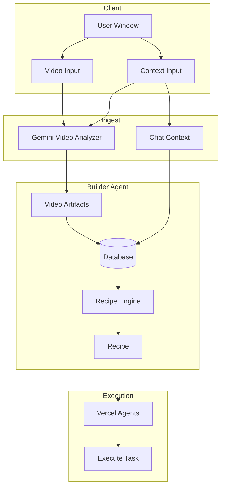

# ReplayAgent Product Requirements Document (PRD)

**Version:** 1.0  
**Last Updated:** March 2025  
**Status:** Draft

---

## 1. Executive Summary

**ReplayAgent** is a web application that converts screen recordings (e.g., Loom videos, local video files) into executable browser automation. The core value proposition: *"Record once, automate forever."*

**Current state:** The product is an early scaffold with a static landing page, a streaming chat API backed by Gemini 2.0 Flash on Google Cloud Vertex AI, and no implemented video ingestion or automation pipeline.

**Target state:** User inputs video + context in a window → Gemini video analyzer produces artifacts → video artifacts + chat context stored in DB (builder agent input) → builder agent derives an executable recipe → Vercel agents execute the recipe.

---

## 2. Problem Statement

Manual browser automation (Playwright, Selenium, Cypress) requires developers to:

- Write scripts from scratch
- Maintain brittle selectors
- Keep tests in sync when UIs change

Screen recordings (Loom, internal demos, tutorials) capture real workflows but remain passive—they cannot be replayed, tested, or automated without manual translation.

**ReplayAgent bridges this gap** by using Gemini's multimodal capabilities to analyze videos and generate executable automation via **agent-browser** (Vercel Labs), reducing time-to-automation and enabling non-developers to create automation from recordings.

---

## 3. User Personas

| Persona | Goal | Pain Point |
|---------|------|------------|
| **QA Engineer** | Turn manual test recordings into automated regression suites | Hand-writing automation from scratch is slow and fragile |
| **Product/Support** | Document and automate internal workflows (e.g., onboarding flows) | Loom videos exist but cannot be turned into executable flows |
| **Developer** | Automate repetitive browser tasks from a quick screen recording | Writing selectors is tedious; selectors break when UI changes |
| **Technical PM** | Validate product flows without automation expertise | Needs to produce testable flows from demos/recordings |

---

## 4. Product Vision & Success Metrics

**Vision:** A self-service platform where users input a video and context; the system analyzes it, stores artifacts + chat in a DB, and the builder agent figures out a recipe that Vercel agents execute.

**Success metrics:**

- Time from video upload to first runnable automation < 5 minutes
- Video artifact accuracy (actions correctly extracted) > 90%
- Vercel agent execution success rate on first run > 70%
- User completion rate for builder-agent workflow > 80%

---

## 5. Current Implementation (As-Built)

### 5.1 Tech Stack

| Layer | Technology |
|-------|-------------|
| Framework | Next.js 15.1 (App Router), React 19 |
| Language | TypeScript (strict) |
| AI | Vercel AI SDK v4, @ai-sdk/google-vertex |
| LLM | Gemini 2.0 Flash (primary), Gemini 2.0 Pro (fallback) |
| Automation | agent-browser (Vercel Labs), @vercel/sandbox (planned) |
| Styling | Tailwind CSS 3.4 |
| Lint | ESLint 9, eslint-config-next |

### 5.2 Implemented Features

- **Landing page** (`src/app/page.tsx`): Static hero, product name, tagline
- **Chat API** (`src/app/api/chat/route.ts`): `POST /api/chat` with streaming Gemini responses
- **Vertex AI** (`src/lib/vertex.ts`): Gemini Flash and Pro model config

### 5.3 Gaps

- No video upload, Loom URL handling, or Gemini video API
- No database; no builder agent; no recipe generation
- No agent-browser or Vercel Sandbox integration
- No components/ directory

---

## 6. Target Architecture

### 6.1 High-Level Flow

```
User Window (video + context)
        │
        ▼
Gemini Video Analyzer ──► Video Artifacts
        │
        ▼
Database ◄── Video Artifacts + Chat Context
        │
        ▼
Builder Agent ──► Recipe (executable plan)
        │
        ▼
Vercel Agents ──► Execute Task
```

### 6.2 Architecture Diagram



### 6.3 Data Flow (Step-by-Step)

1. **User input:** User provides video and context in a single window (video upload + text/chat context).
2. **Gemini video analyzer:** Video and context are sent to Gemini; it produces **video artifacts** (extracted actions, UI structure).
3. **Chat context:** User conversation is captured.
4. **Store in DB:** Video artifacts + chat context are written to the database — builder agent input.
5. **Builder agent:** Reads from DB and produces a **recipe** (executable plan).
6. **Vercel agents:** Execute the recipe (agent-browser via Vercel Sandbox).

### 6.4 UI Layout

| Element | Role |
|---------|------|
| **Video input** | Upload (drag-drop, Loom URL) or paste video |
| **Context input** | Text field or chat for task description, questions, instructions |
| **Chat pane (side)** | Optional side panel; all chat stored with video artifacts |

### 6.5 Builder Agent

The **builder agent**:

- Consumes video artifacts (from Gemini) and chat context (from conversation) stored in the DB
- Produces a **recipe** — a step-by-step executable plan
- Outputs a format Vercel agents can run (e.g., agent-browser commands)

### 6.6 Vercel Agents (agent-browser)

- **CLI-based:** `open`, `snapshot -i`, `click @e1`, `fill @e2 "text"`
- **Vercel Sandbox:** Linux microVM via `@vercel/sandbox`; Chrome runs on demand
- **Snapshots:** Optional `AGENT_BROWSER_SNAPSHOT_ID` for sub-second startup
- **Deployment:** Vercel OIDC auth; local dev needs `VERCEL_TOKEN`, `VERCEL_TEAM_ID`, `VERCEL_PROJECT_ID`

---

## 7. Feature Requirements (Roadmap)

### Phase 1: Video Ingestion

| ID | Requirement |
|----|-------------|
| FR-1.1 | Accept direct video file upload (MP4, WebM; max size TBD) |
| FR-1.2 | Accept Loom URL; fetch video via Loom API or public embed |
| FR-1.3 | Store video in GCP Cloud Storage (or equivalent) |
| FR-1.4 | Return video reference (ID/URL) for downstream analysis |

### Phase 2: Gemini Analysis and Storage (Builder Agent Input)

| ID | Requirement |
|----|-------------|
| FR-2.1 | Send video + context to Gemini Video API |
| FR-2.2 | Gemini produces video artifacts (extracted actions, UI structure) |
| FR-2.3 | Capture chat context alongside video artifacts |
| FR-2.4 | Store video artifacts + chat context in DB |

### Phase 2.5: UI Layout

| ID | Requirement |
|----|-------------|
| FR-2.5 | Single window: video input (upload, Loom URL) + context input |
| FR-2.6 | Optional side chat pane; chat stored with artifacts |

### Phase 3: Builder Agent and Recipe

| ID | Requirement |
|----|-------------|
| FR-3.1 | Builder agent reads video artifacts + chat context from DB |
| FR-3.2 | Builder agent derives a recipe (executable plan) |
| FR-3.3 | Recipe format compatible with Vercel agents |

### Phase 4: Vercel Agents Execution

| ID | Requirement |
|----|-------------|
| FR-4.0 | Integrate `@vercel/sandbox` + agent-browser |
| FR-4.1 | Execute recipe via Vercel agents; streaming progress UI |
| FR-4.2 | Use element refs from `agent-browser snapshot -i` |

### Phase 5: Resilience

| ID | Requirement |
|----|-------------|
| FR-5.1 | Capture failures; optionally re-analyze with Gemini for fixes |
| FR-5.2 | Re-snapshot on failure and retry with updated refs |

---

## 8. Non-Functional Requirements

| Category | Requirement |
|----------|--------------|
| **Security** | No video stored permanently by default; support ephemeral processing |
| **Privacy** | Processing in user GCP project (Vertex AI); no third-party data sharing |
| **Performance** | Video analysis < 2 min for videos up to 10 min |
| **Availability** | Stateless API design for horizontal scaling |
| **Cost** | Gemini Flash as default; Pro for long/complex videos |

---

## 9. Data Model

### 9.1 Core Entities

```
Video
  id, source (upload | loom), url/path, createdAt

ArtifactRecord   # Builder agent input (stored in DB)
  id, videoId, videoArtifacts (JSON), chatContext (messages[]), createdAt

Recipe           # Builder agent output
  id, artifactRecordId, steps: RecipeStep[], status, createdAt

RecipeStep
  order, action (click | type | navigate | wait | select), target?, value?, ref?
```

### 9.2 Video Artifacts Schema (JSON)

```json
{
  "actions": [
    { "order": 1, "type": "navigate", "url": "https://example.com" },
    { "order": 2, "type": "click", "selector": "button.primary" },
    { "order": 3, "type": "type", "selector": "#email", "value": "..." }
  ],
  "uiStructure": { }
}
```

---

## 10. API Routes

| Route | Method | Purpose |
|-------|--------|---------|
| `/api/ingest` | POST | Upload video + context; store in DB; trigger Gemini analysis |
| `/api/analyze` | POST | Gemini video analyzer → video artifacts; store artifacts + chat in DB |
| `/api/build` | POST | Builder agent: read from DB, derive recipe |
| `/api/execute` | POST | Run recipe via Vercel agents; stream progress |
| `/api/chat` | POST | Chat; context captured and stored with video artifacts |

---

## 11. Environment Variables

### Required (GCP / Vertex AI)

| Variable | Description |
|----------|-------------|
| `GOOGLE_APPLICATION_CREDENTIALS` | Path to service account JSON |
| `GOOGLE_VERTEX_PROJECT` | GCP project ID |
| `GOOGLE_VERTEX_LOCATION` | e.g. `us-central1` |

### Required for agent-browser (Vercel Sandbox)

| Variable | Description |
|----------|-------------|
| `AGENT_BROWSER_SNAPSHOT_ID` | Sandbox snapshot for sub-second startup |
| `VERCEL_TOKEN` | Personal access token (local dev) |
| `VERCEL_TEAM_ID` | Team ID (local dev) |
| `VERCEL_PROJECT_ID` | Project ID (local dev) |

---

## 12. Open Questions

1. **Database:** PostgreSQL vs. Vercel KV vs. other for video artifacts + chat context?
2. **Loom:** OAuth vs. public URL fetching; rate limits and costs?
3. **Vercel Sandbox:** Alternative for non-Vercel (e.g., self-hosted) deployments?
4. **Sandbox snapshot:** Create `AGENT_BROWSER_SNAPSHOT_ID` as part of setup?
5. **Multi-tenancy:** Single-tenant (user GCP) vs. managed SaaS?

---

## 13. Appendix: Key Files

| File | Role |
|------|------|
| `src/app/page.tsx` | Landing page |
| `src/app/api/chat/route.ts` | Chat streaming API |
| `src/lib/vertex.ts` | Vertex AI / Gemini provider |
| `README.md` | Project docs |
| `.env.example` | Config template |
